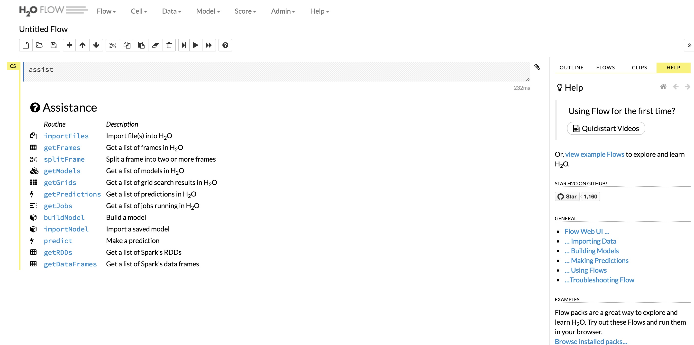
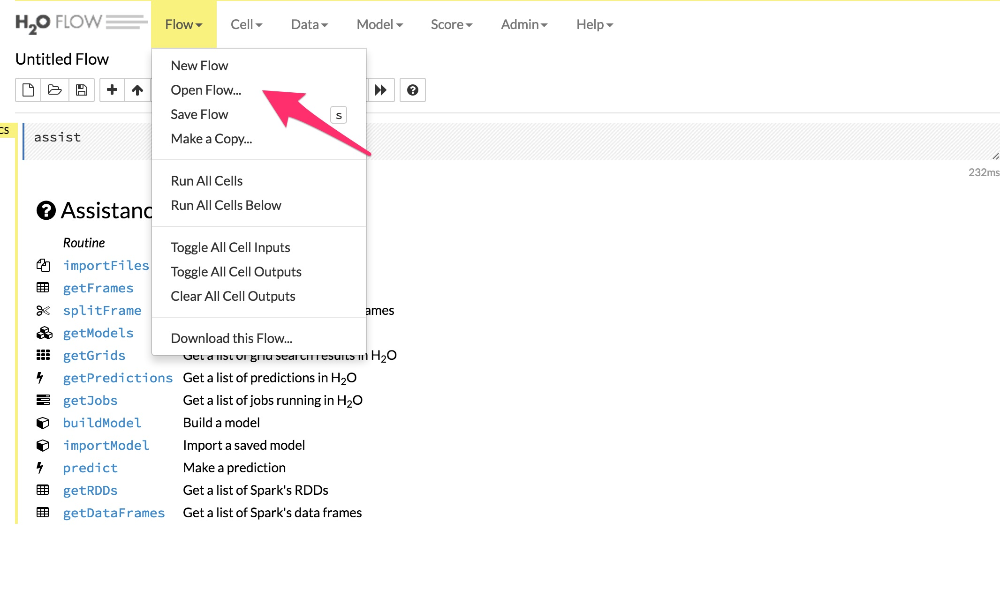
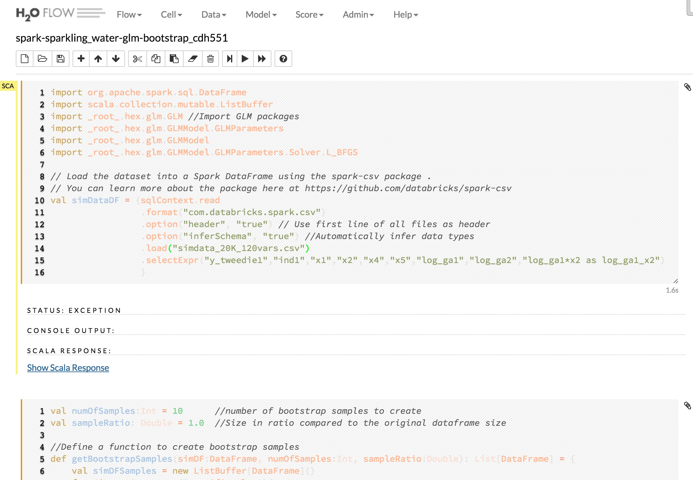

H2O Examples Flow UI
====================

H2O flow is a web interface to do data transformation and run machine learning algorithms. 

Learn more about H2O Flow UI [here](http://www.h2o.ai/product/flow/)

Once H2o Cloud services are started, open the H2o flow UI as shown below.

Open the flow files as shown below.

Once the flow file is uploaded successfully, we can now see the scala code. We should now be able to select each cell and run the scala code in that cell.

