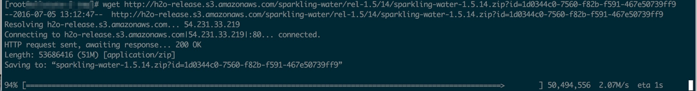
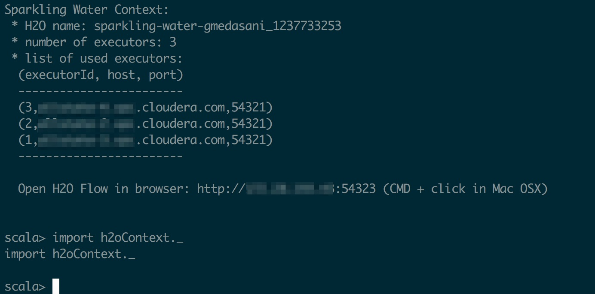

Spark Examples Scala Shell
==========================

Download the data from github and load it into your hdfs directories.

## To run Spark MLlib shell examples

* Download the spark-csv and commons-csv jars from the maven repo as shown below

```
wget https://repo1.maven.org/maven2/com/databricks/spark-csv_2.11/1.4.0/spark-csv_2.11-1.4.0.jar
wget http://repo1.maven.org/maven2/com/databricks/spark-csv_2.10/1.4.0/spark-csv_2.10-1.4.0.jar
wget https://repo1.maven.org/maven2/org/apache/commons/commons-csv/1.1/commons-csv-1.1.jar
```

* Run the spark-shell command as shown below

```
spark-shell --master yarn --deploy-mode client --name spark-mllib-bootstrap-examples --driver-memory 4G \ 
--executor-memory 4G --executor-cores 3 --num-executors 3 --jars commons-csv-1.1.jar,spark-csv_2.10-1.4.0.jar
```

* Once the spark-shell starts, you can run the code in this section that is related to spark and mllib.


## To run Sparkling Water shell examples

* Download the appropriate sparkling water from this h2o page, [Sparkling Water Download](http://www.h2o.ai/download/sparkling-water/choose)



* Expand the downloaded zip file. Edit the following line of the file bin/sparkling-shell in the downloaded sparkling-water directory to add commons-csv and spark-csv jars to the --jars argument.

```
$SPARK_HOME/bin/spark-shell --jars $TOPDIR/assembly/build/libs/$FAT_JAR,commons-csv-1.1.jar,spark-csv_2.10-1.4.0.jar --driver-memory $DRIVER_MEMORY --conf spark.driver.extraJavaOptions="$EXTRA_DRIVER_PROPS -XX:MaxPermSize=384m" "$@"

```

* Once sparkling-shell has been updated, you can start the sparkling-shell as shown below.

```
export SPARK_HOME=/opt/cloudera/parcels/CDH/lib/spark/
export HADOOP_CONF_DIR=/etc/hadoop/conf
export JAVA_HOME=/usr/java/default/
./sparkling-water-1.5.14/bin/sparkling-shell --num-executors 3 --executor-memory 4g --executor-cores 3 --driver-memory 4g --master yarn-client

```

* If the sparkling-shell stars successfully, you will see a message similar to the following.

```
-----
  Spark master (MASTER)     : yarn-client
  Spark home   (SPARK_HOME) : /opt/cloudera/parcels/CDH-5.5.1-1.cdh5.5.1.p1168.923/lib/spark
  H2O build version         : 3.8.2.3 (turchin)
  Spark build version       : 1.5.2
-----
 
Java HotSpot(TM) 64-Bit Server VM warning: ignoring option MaxPermSize=384m; support was removed in 8.0
SLF4J: Class path contains multiple SLF4J bindings.
SLF4J: Found binding in [jar:file:/opt/cloudera/parcels/CDH-5.5.1-1.cdh5.5.1.p1168.923/jars/avro-tools-1.7.6-cdh5.5.1.jar!/org/slf4j/impl/StaticLoggerBinder.class]
SLF4J: Found binding in [jar:file:/opt/cloudera/parcels/CDH-5.5.1-1.cdh5.5.1.p1168.923/jars/slf4j-log4j12-1.7.5.jar!/org/slf4j/impl/StaticLoggerBinder.class]
SLF4J: See http://www.slf4j.org/codes.html#multiple_bindings for an explanation.
Welcome to
      ____              __
     / __/__  ___ _____/ /__
    _\ \/ _ \/ _ `/ __/  '_/
   /___/ .__/\_,_/_/ /_/\_\   version 1.5.0-cdh5.5.1
      /_/
 
Using Scala version 2.10.4 (Java HotSpot(TM) 64-Bit Server VM, Java 1.8.0_66)
Type in expressions to have them evaluated.
Type :help for more information.
Spark context available as sc.
SQL context available as sqlContext.

```

* Create a H2o cloud inside the Spark cluster using the following steps.

```
import org.apache.spark.h2o._
val h2oContext = new H2OContext(sc).start()
import h2oContext._
```

* Once the H2O cloud services start successfully you will see a screen similar to the following.




* Once H2O cloud services start, you can run the code in this section that is related to sparkling-water.
